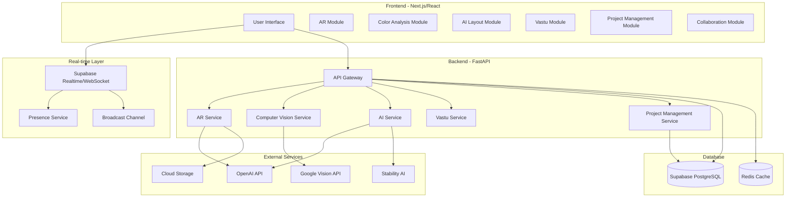
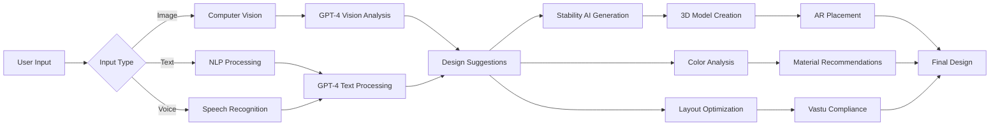

# Design Document

## Overview

This design document outlines the architecture and implementation strategy for transforming the existing AR Placement, Colors, AI Layout, Vastu, Project Management, and Collaborate pages into fully functional, real-time professional tools for architects and interior designers. The system will leverage modern web technologies including WebSockets (via Supabase Realtime), WebGL/Three.js for 3D rendering, computer vision APIs, and AI services to provide production-ready features.

### Key Design Principles

1. **Real-time First**: All collaborative features use WebSocket connections for instant updates
2. **Progressive Enhancement**: Features work offline with sync when connection restored
3. **Mobile-Responsive**: Full functionality on desktop, tablet, and mobile devices
4. **Performance Optimized**: Lazy loading, caching, and efficient rendering
5. **Professional Grade**: Industry-standard file formats, accurate measurements, and reliable calculations
6. **Indian Market Focus**: Localized for Indian architecture, materials, costs, and regulations

## Architecture

### System Architecture Diagram



### Technology Stack

**Frontend:**
- Next.js 14 (App Router)
- React 18 with TypeScript
- Three.js / React Three Fiber (3D rendering)
- TensorFlow.js (client-side ML)
- Supabase Client (real-time subscriptions)
- Tailwind CSS + shadcn/ui components
- Zustand (state management)

**Backend:**
- FastAPI (Python 3.11+)
- Supabase (PostgreSQL + Realtime)
- Redis (caching and session management)
- OpenAI API (GPT-4 for AI features)
- Google Cloud Vision API (image analysis)
- Stability AI (image generation)

**Infrastructure:**
- Vercel (frontend hosting)
- Railway/Render (backend hosting)
- Supabase Cloud (database + realtime)
- Cloudflare R2/AWS S3 (file storage)
- Redis Cloud (caching)

## Components and Interfaces

### 1. Real-Time AR Placement System

#### Component Architecture


```typescript
// AR Scene Manager
interface ARSceneManager {
  initializeScene(): Promise<void>;
  detectSurfaces(imageData: ImageData): Promise<Surface[]>;
  placeObject(object: FurnitureModel, position: Vector3): Promise<PlacedObject>;
  updateObject(objectId: string, transform: Transform): void;
  removeObject(objectId: string): void;
  detectCollisions(): CollisionResult[];
  adjustLighting(lightingConditions: LightingData): void;
  saveScene(): Promise<SceneData>;
  loadScene(sceneId: string): Promise<void>;
}

// Surface Detection Service
interface SurfaceDetectionService {
  detectPlanes(image: HTMLImageElement): Promise<Plane[]>;
  calculateDimensions(plane: Plane): Dimensions;
  identifyWalls(planes: Plane[]): Wall[];
  detectFloor(planes: Plane[]): Floor | null;
}

// 3D Model Service
interface ModelService {
  loadModel(modelUrl: string): Promise<THREE.Object3D>;
  applyMaterial(model: THREE.Object3D, material: Material): void;
  optimizeModel(model: THREE.Object3D): THREE.Object3D;
  generateThumbnail(model: THREE.Object3D): Promise<string>;
}
```

#### Data Models

```typescript
interface PlacedObject {
  id: string;
  furnitureId: string;
  position: Vector3;
  rotation: Vector3;
  scale: Vector3;
  model: THREE.Object3D;
  metadata: {
    name: string;
    dimensions: Dimensions;
    price: number;
    material: string;
  };
}

interface Surface {
  id: string;
  type: 'floor' | 'wall' | 'ceiling';
  vertices: Vector3[];
  normal: Vector3;
  area: number;
}

interface ARScene {
  id: string;
  projectId: string;
  name: string;
  objects: PlacedObject[];
  roomDimensions: Dimensions;
  lightingConditions: LightingData;
  cameraPosition: Vector3;
  createdAt: Date;
  updatedAt: Date;
}
```

### 2. Intelligent Color Analysis System

#### Component Architecture

```typescript
// Color Analysis Service
interface ColorAnalysisService {
  extractColors(image: HTMLImageElement): Promise<ColorPalette>;
  generateScheme(baseColor: Color, scheme: SchemeType): ColorScheme;
  analyzeHarmony(colors: Color[]): HarmonyScore;
  suggestPaintBrands(color: Color): PaintBrandMatch[];
  calculateAccessibility(fg: Color, bg: Color): AccessibilityScore;
}

// Image Color Extractor
interface ImageColorExtractor {
  getDominantColors(image: HTMLImageElement, count: number): Promise<Color[]>;
  getColorPercentages(image: HTMLImageElement): Promise<ColorDistribution>;
  identifyAccentColors(image: HTMLImageElement): Promise<Color[]>;
}

// Color Recommendation Engine
interface ColorRecommendationEngine {
  generateComplementary(color: Color): Color[];
  generateAnalogous(color: Color): Color[];
  generateTriadic(color: Color): Color[];
  generateMonochromatic(color: Color): Color[];
  considerLighting(colors: Color[], lighting: LightingType): Color[];
}
```

#### Data Models

```typescript
interface Color {
  hex: string;
  rgb: RGB;
  hsl: HSL;
  name: string;
}

interface ColorPalette {
  dominant: Color;
  secondary: Color;
  accent: Color;
  supporting: Color[];
  distribution: ColorDistribution;
}

interface ColorScheme {
  name: string;
  colors: Color[];
  harmony: HarmonyScore;
  accessibility: AccessibilityScore;
  paintBrands: PaintBrandMatch[];
  applications: ColorApplication[];
}

interface PaintBrandMatch {
  brand: string;
  productName: string;
  code: string;
  color: Color;
  price: number;
  availability: string;
}
```

### 3. AI Layout Generation System

#### Component Architecture


```typescript
// AI Layout Generator
interface AILayoutGenerator {
  generateLayouts(room: RoomSpec, constraints: LayoutConstraints): Promise<Layout[]>;
  optimizeLayout(layout: Layout, criteria: OptimizationCriteria): Promise<Layout>;
  validateLayout(layout: Layout): ValidationResult;
  calculateMetrics(layout: Layout): LayoutMetrics;
}

// Floor Plan Parser
interface FloorPlanParser {
  parseImage(image: HTMLImageElement): Promise<FloorPlan>;
  detectRooms(floorPlan: FloorPlan): Room[];
  identifyDoors(floorPlan: FloorPlan): Door[];
  identifyWindows(floorPlan: FloorPlan): Window[];
  calculateDimensions(floorPlan: FloorPlan): Dimensions;
}

// Furniture Placement Optimizer
interface FurniturePlacementOptimizer {
  optimizeForTrafficFlow(layout: Layout): Layout;
  optimizeForErgonomics(layout: Layout): Layout;
  optimizeForSpaceUtilization(layout: Layout): Layout;
  checkAccessibility(layout: Layout): AccessibilityReport;
}
```

#### Data Models

```typescript
interface Layout {
  id: string;
  name: string;
  roomType: string;
  dimensions: Dimensions;
  furniture: FurniturePlacement[];
  trafficPaths: Path[];
  metrics: LayoutMetrics;
  score: number;
}

interface FurniturePlacement {
  id: string;
  furnitureType: string;
  position: Vector2;
  rotation: number;
  dimensions: Dimensions;
}

interface LayoutMetrics {
  usableSpacePercentage: number;
  trafficFlowEfficiency: number;
  ergonomicScore: number;
  accessibilityScore: number;
  functionalZones: Zone[];
}
```

### 4. Vastu Compliance System

#### Component Architecture

```typescript
// Vastu Analyzer
interface VastuAnalyzer {
  analyzeRoom(room: Room, direction: Direction): VastuAnalysis;
  analyzeFloorPlan(floorPlan: FloorPlan): FloorPlanAnalysis;
  suggestRemedies(violations: VastuViolation[]): Remedy[];
  calculateScore(analysis: VastuAnalysis): number;
}

// Direction Calculator
interface DirectionCalculator {
  detectOrientation(image: HTMLImageElement): Promise<Orientation>;
  calculateCompassDirection(location: GeoLocation): Direction;
  mapRoomToDirection(room: Room, floorPlan: FloorPlan): Direction;
}
```

#### Data Models

```typescript
interface VastuAnalysis {
  roomType: string;
  direction: Direction;
  status: 'excellent' | 'good' | 'average' | 'poor' | 'critical';
  score: number;
  violations: VastuViolation[];
  recommendations: string[];
  benefits: string[];
  element: VastuElement;
}

interface VastuViolation {
  severity: 'critical' | 'moderate' | 'minor';
  principle: string;
  description: string;
  remedies: Remedy[];
}

interface Remedy {
  type: 'placement' | 'color' | 'element' | 'structural';
  description: string;
  cost: number;
  effectiveness: number;
}
```

### 5. Real-Time Project Management System

#### Component Architecture

```typescript
// Project Management Service
interface ProjectManagementService {
  createProject(data: ProjectData): Promise<Project>;
  updateProject(id: string, data: Partial<ProjectData>): Promise<Project>;
  addTask(projectId: string, task: TaskData): Promise<Task>;
  updateTask(taskId: string, data: Partial<TaskData>): Promise<Task>;
  addMember(projectId: string, userId: string, role: Role): Promise<void>;
  trackExpense(projectId: string, expense: ExpenseData): Promise<Expense>;
  generateReport(projectId: string, type: ReportType): Promise<Report>;
}

// Real-time Sync Service
interface RealtimeSyncService {
  subscribeToProject(projectId: string, callbacks: ProjectCallbacks): () => void;
  broadcastUpdate(projectId: string, update: Update): void;
  syncOfflineChanges(changes: Change[]): Promise<void>;
}

// Timeline Manager
interface TimelineManager {
  generateGanttChart(project: Project): GanttChart;
  calculateCriticalPath(tasks: Task[]): Task[];
  identifyDependencies(tasks: Task[]): Dependency[];
  updateTimeline(taskId: string, newDates: DateRange): void;
}
```

#### Data Models


```typescript
interface Project {
  id: string;
  name: string;
  description: string;
  ownerId: string;
  budget: number;
  timeline: number;
  status: ProjectStatus;
  tasks: Task[];
  members: ProjectMember[];
  expenses: Expense[];
  milestones: Milestone[];
  createdAt: Date;
  updatedAt: Date;
}

interface Task {
  id: string;
  projectId: string;
  name: string;
  description: string;
  assignedTo: string;
  status: TaskStatus;
  priority: Priority;
  startDate: Date;
  endDate: Date;
  dependencies: string[];
  cost: number;
  progress: number;
}

interface ProjectMember {
  userId: string;
  role: 'owner' | 'editor' | 'viewer';
  permissions: Permission[];
  joinedAt: Date;
  presence: PresenceStatus;
}
```

### 6. Multi-User Collaboration System

#### Component Architecture

```typescript
// Collaboration Manager
interface CollaborationManager {
  joinSession(projectId: string, userId: string): Promise<Session>;
  leaveSession(sessionId: string): void;
  broadcastCursor(position: Vector2): void;
  broadcastSelection(elementId: string): void;
  sendMessage(message: Message): void;
  addAnnotation(annotation: Annotation): Promise<void>;
}

// Presence Service
interface PresenceService {
  trackUser(userId: string, projectId: string): void;
  updateStatus(userId: string, status: PresenceStatus): void;
  getActiveUsers(projectId: string): User[];
  subscribeToPresence(projectId: string, callback: PresenceCallback): () => void;
}

// Conflict Resolution Service
interface ConflictResolutionService {
  detectConflict(change1: Change, change2: Change): boolean;
  resolveConflict(conflicts: Conflict[]): Resolution;
  applyOperationalTransform(operations: Operation[]): void;
}
```

#### Data Models

```typescript
interface Session {
  id: string;
  projectId: string;
  users: SessionUser[];
  startedAt: Date;
}

interface SessionUser {
  userId: string;
  username: string;
  avatar: string;
  cursor: Vector2;
  selectedElement: string | null;
  color: string;
  status: PresenceStatus;
}

interface Annotation {
  id: string;
  userId: string;
  position: Vector2;
  type: 'comment' | 'drawing' | 'measurement';
  content: string;
  createdAt: Date;
}
```

## Data Models

### Database Schema (Supabase PostgreSQL)

```sql
-- Projects table
CREATE TABLE projects (
  id UUID PRIMARY KEY DEFAULT uuid_generate_v4(),
  name TEXT NOT NULL,
  description TEXT,
  owner_id UUID REFERENCES auth.users(id),
  budget DECIMAL(12, 2),
  timeline INTEGER,
  status TEXT DEFAULT 'active',
  location TEXT,
  project_type TEXT,
  created_at TIMESTAMP DEFAULT NOW(),
  updated_at TIMESTAMP DEFAULT NOW()
);

-- Project members table
CREATE TABLE project_members (
  id UUID PRIMARY KEY DEFAULT uuid_generate_v4(),
  project_id UUID REFERENCES projects(id) ON DELETE CASCADE,
  user_id UUID REFERENCES auth.users(id),
  role TEXT NOT NULL,
  permissions JSONB,
  joined_at TIMESTAMP DEFAULT NOW(),
  UNIQUE(project_id, user_id)
);

-- Tasks table
CREATE TABLE project_tasks (
  id UUID PRIMARY KEY DEFAULT uuid_generate_v4(),
  project_id UUID REFERENCES projects(id) ON DELETE CASCADE,
  name TEXT NOT NULL,
  description TEXT,
  assigned_to UUID REFERENCES auth.users(id),
  status TEXT DEFAULT 'pending',
  priority TEXT DEFAULT 'medium',
  start_date DATE,
  end_date DATE,
  cost DECIMAL(12, 2),
  progress INTEGER DEFAULT 0,
  dependencies JSONB,
  created_by UUID REFERENCES auth.users(id),
  created_at TIMESTAMP DEFAULT NOW(),
  updated_at TIMESTAMP DEFAULT NOW()
);

-- Materials table
CREATE TABLE materials (
  id UUID PRIMARY KEY DEFAULT uuid_generate_v4(),
  project_id UUID REFERENCES projects(id) ON DELETE CASCADE,
  name TEXT NOT NULL,
  category TEXT,
  unit TEXT,
  unit_cost DECIMAL(10, 2),
  quantity DECIMAL(10, 2),
  total_cost DECIMAL(12, 2),
  supplier TEXT,
  created_by UUID REFERENCES auth.users(id),
  created_at TIMESTAMP DEFAULT NOW(),
  updated_at TIMESTAMP DEFAULT NOW()
);

-- Expenses table
CREATE TABLE expenses (
  id UUID PRIMARY KEY DEFAULT uuid_generate_v4(),
  project_id UUID REFERENCES projects(id) ON DELETE CASCADE,
  name TEXT NOT NULL,
  category TEXT,
  amount DECIMAL(12, 2),
  date DATE,
  notes TEXT,
  receipt_url TEXT,
  created_by UUID REFERENCES auth.users(id),
  created_at TIMESTAMP DEFAULT NOW()
);

-- AR Scenes table
CREATE TABLE ar_scenes (
  id UUID PRIMARY KEY DEFAULT uuid_generate_v4(),
  project_id UUID REFERENCES projects(id) ON DELETE CASCADE,
  name TEXT NOT NULL,
  scene_data JSONB NOT NULL,
  thumbnail_url TEXT,
  room_dimensions JSONB,
  created_by UUID REFERENCES auth.users(id),
  created_at TIMESTAMP DEFAULT NOW(),
  updated_at TIMESTAMP DEFAULT NOW()
);

-- Color palettes table
CREATE TABLE color_palettes (
  id UUID PRIMARY KEY DEFAULT uuid_generate_v4(),
  project_id UUID REFERENCES projects(id) ON DELETE CASCADE,
  name TEXT NOT NULL,
  palette_data JSONB NOT NULL,
  room_type TEXT,
  style TEXT,
  created_by UUID REFERENCES auth.users(id),
  created_at TIMESTAMP DEFAULT NOW()
);

-- Layouts table
CREATE TABLE layouts (
  id UUID PRIMARY KEY DEFAULT uuid_generate_v4(),
  project_id UUID REFERENCES projects(id) ON DELETE CASCADE,
  name TEXT NOT NULL,
  layout_data JSONB NOT NULL,
  room_type TEXT,
  dimensions JSONB,
  metrics JSONB,
  score DECIMAL(5, 2),
  created_by UUID REFERENCES auth.users(id),
  created_at TIMESTAMP DEFAULT NOW(),
  updated_at TIMESTAMP DEFAULT NOW()
);

-- Vastu analyses table
CREATE TABLE vastu_analyses (
  id UUID PRIMARY KEY DEFAULT uuid_generate_v4(),
  project_id UUID REFERENCES projects(id) ON DELETE CASCADE,
  room_type TEXT NOT NULL,
  direction TEXT NOT NULL,
  analysis_data JSONB NOT NULL,
  score INTEGER,
  created_by UUID REFERENCES auth.users(id),
  created_at TIMESTAMP DEFAULT NOW()
);

-- User presence table
CREATE TABLE user_presence (
  user_id UUID REFERENCES auth.users(id) PRIMARY KEY,
  project_id UUID REFERENCES projects(id) ON DELETE CASCADE,
  status TEXT DEFAULT 'online',
  cursor_position JSONB,
  selected_element TEXT,
  last_seen TIMESTAMP DEFAULT NOW()
);

-- Annotations table
CREATE TABLE annotations (
  id UUID PRIMARY KEY DEFAULT uuid_generate_v4(),
  project_id UUID REFERENCES projects(id) ON DELETE CASCADE,
  user_id UUID REFERENCES auth.users(id),
  type TEXT NOT NULL,
  position JSONB,
  content TEXT,
  resolved BOOLEAN DEFAULT FALSE,
  created_at TIMESTAMP DEFAULT NOW()
);

-- Chat messages table
CREATE TABLE chat_messages (
  id UUID PRIMARY KEY DEFAULT uuid_generate_v4(),
  project_id UUID REFERENCES projects(id) ON DELETE CASCADE,
  user_id UUID REFERENCES auth.users(id),
  message TEXT NOT NULL,
  attachments JSONB,
  created_at TIMESTAMP DEFAULT NOW()
);
```

### Real-time Subscriptions

```typescript
// Supabase Realtime Channels
const subscribeToProject = (projectId: string) => {
  // Subscribe to project changes
  const projectChannel = supabase
    .channel(`project:${projectId}`)
    .on('postgres_changes', {
      event: '*',
      schema: 'public',
      table: 'projects',
      filter: `id=eq.${projectId}`
    }, handleProjectChange)
    .on('postgres_changes', {
      event: '*',
      schema: 'public',
      table: 'project_tasks',
      filter: `project_id=eq.${projectId}`
    }, handleTaskChange)
    .on('postgres_changes', {
      event: '*',
      schema: 'public',
      table: 'materials',
      filter: `project_id=eq.${projectId}`
    }, handleMaterialChange)
    .on('presence', { event: 'sync' }, handlePresenceSync)
    .on('presence', { event: 'join' }, handlePresenceJoin)
    .on('presence', { event: 'leave' }, handlePresenceLeave)
    .on('broadcast', { event: 'cursor' }, handleCursorMove)
    .on('broadcast', { event: 'selection' }, handleSelection)
    .subscribe();

  return () => {
    supabase.removeChannel(projectChannel);
  };
};
```

## Error Handling

### Error Types and Strategies


```typescript
// Error handling strategy
enum ErrorType {
  NETWORK_ERROR = 'NETWORK_ERROR',
  API_ERROR = 'API_ERROR',
  VALIDATION_ERROR = 'VALIDATION_ERROR',
  PERMISSION_ERROR = 'PERMISSION_ERROR',
  RESOURCE_NOT_FOUND = 'RESOURCE_NOT_FOUND',
  CONFLICT_ERROR = 'CONFLICT_ERROR',
  RATE_LIMIT_ERROR = 'RATE_LIMIT_ERROR'
}

interface ErrorHandler {
  handleError(error: Error, context: ErrorContext): void;
  retry(operation: () => Promise<any>, maxRetries: number): Promise<any>;
  fallback(error: Error): any;
}

// Retry logic with exponential backoff
const retryWithBackoff = async (
  fn: () => Promise<any>,
  maxRetries: number = 3,
  delay: number = 1000
): Promise<any> => {
  try {
    return await fn();
  } catch (error) {
    if (maxRetries === 0) throw error;
    await new Promise(resolve => setTimeout(resolve, delay));
    return retryWithBackoff(fn, maxRetries - 1, delay * 2);
  }
};

// Offline queue for failed operations
class OfflineQueue {
  private queue: Operation[] = [];
  
  enqueue(operation: Operation): void {
    this.queue.push(operation);
    localStorage.setItem('offline_queue', JSON.stringify(this.queue));
  }
  
  async processQueue(): Promise<void> {
    while (this.queue.length > 0) {
      const operation = this.queue[0];
      try {
        await operation.execute();
        this.queue.shift();
      } catch (error) {
        console.error('Failed to process queued operation:', error);
        break;
      }
    }
    localStorage.setItem('offline_queue', JSON.stringify(this.queue));
  }
}
```

## Testing Strategy

### Unit Tests
- Component logic testing with Jest
- Service layer testing with mocked dependencies
- Utility function testing

### Integration Tests
- API endpoint testing with FastAPI TestClient
- Database operations testing with test database
- Real-time subscription testing

### E2E Tests
- User flow testing with Playwright
- Cross-browser compatibility testing
- Mobile responsiveness testing

### Performance Tests
- Load testing with k6
- Real-time latency testing
- 3D rendering performance testing

```typescript
// Example test structure
describe('ARSceneManager', () => {
  it('should detect surfaces from image', async () => {
    const manager = new ARSceneManager();
    const surfaces = await manager.detectSurfaces(mockImageData);
    expect(surfaces).toHaveLength(3);
    expect(surfaces[0].type).toBe('floor');
  });

  it('should place object without collision', async () => {
    const manager = new ARSceneManager();
    const object = await manager.placeObject(mockFurniture, mockPosition);
    expect(object).toBeDefined();
    expect(manager.detectCollisions()).toHaveLength(0);
  });
});
```

## Security Considerations

### Authentication & Authorization
- JWT-based authentication via Supabase Auth
- Row-level security (RLS) policies on all tables
- Role-based access control (RBAC) for project members
- API key rotation for external services

### Data Protection
- Encryption at rest for sensitive data
- HTTPS/WSS for all communications
- Input validation and sanitization
- SQL injection prevention via parameterized queries

### Rate Limiting
- API rate limiting per user/IP
- WebSocket connection limits
- File upload size restrictions
- Concurrent operation limits

```sql
-- Row Level Security Policies
ALTER TABLE projects ENABLE ROW LEVEL SECURITY;

CREATE POLICY "Users can view projects they are members of"
  ON projects FOR SELECT
  USING (
    auth.uid() = owner_id OR
    EXISTS (
      SELECT 1 FROM project_members
      WHERE project_id = projects.id
      AND user_id = auth.uid()
    )
  );

CREATE POLICY "Only owners can delete projects"
  ON projects FOR DELETE
  USING (auth.uid() = owner_id);
```

## Performance Optimization

### Frontend Optimization
- Code splitting and lazy loading
- Image optimization with Next.js Image
- Virtual scrolling for large lists
- Memoization of expensive computations
- Web Workers for heavy processing

### Backend Optimization
- Redis caching for frequently accessed data
- Database query optimization with indexes
- Connection pooling
- Async/await for I/O operations
- CDN for static assets

### 3D Rendering Optimization
- Level of Detail (LOD) for 3D models
- Frustum culling
- Texture compression
- Instanced rendering for repeated objects
- Progressive loading of models

```typescript
// Performance monitoring
const performanceMonitor = {
  measureRenderTime: (callback: () => void) => {
    const start = performance.now();
    callback();
    const end = performance.now();
    console.log(`Render time: ${end - start}ms`);
  },
  
  trackAPILatency: async (apiCall: () => Promise<any>) => {
    const start = performance.now();
    const result = await apiCall();
    const end = performance.now();
    analytics.track('api_latency', { duration: end - start });
    return result;
  }
};
```

## Deployment Strategy

### CI/CD Pipeline
1. Code push to GitHub
2. Automated tests run (unit, integration, E2E)
3. Build frontend (Next.js)
4. Build backend (Docker container)
5. Deploy to staging environment
6. Run smoke tests
7. Deploy to production (blue-green deployment)
8. Monitor for errors

### Environment Configuration
- Development: Local development with hot reload
- Staging: Production-like environment for testing
- Production: Optimized build with monitoring

### Monitoring & Logging
- Sentry for error tracking
- Vercel Analytics for frontend metrics
- Custom logging for backend operations
- Real-time alerts for critical errors

## Migration Strategy

### Phase 1: Infrastructure Setup (Week 1-2)
- Set up Supabase project with database schema
- Configure Redis cache
- Set up external API integrations
- Deploy backend services

### Phase 2: Core Features (Week 3-6)
- Implement AR placement system
- Implement color analysis system
- Implement AI layout generation
- Implement Vastu analysis

### Phase 3: Real-time Features (Week 7-8)
- Implement WebSocket connections
- Implement presence tracking
- Implement collaborative editing
- Implement real-time sync

### Phase 4: Polish & Testing (Week 9-10)
- Performance optimization
- Bug fixes
- User acceptance testing
- Documentation

### Phase 5: Launch (Week 11-12)
- Gradual rollout to users
- Monitor performance and errors
- Gather user feedback
- Iterate based on feedback

## API Specifications

### REST API Endpoints

```typescript
// AR Placement APIs
POST   /api/ar/scenes                    // Create AR scene
GET    /api/ar/scenes/:id                // Get AR scene
PUT    /api/ar/scenes/:id                // Update AR scene
DELETE /api/ar/scenes/:id                // Delete AR scene
POST   /api/ar/detect-surfaces           // Detect surfaces from image
POST   /api/ar/place-object              // Place object in scene

// Color Analysis APIs
POST   /api/colors/analyze               // Analyze image colors
POST   /api/colors/generate-scheme       // Generate color scheme
GET    /api/colors/paint-brands          // Get paint brand matches
POST   /api/colors/preview               // Preview colors on image

// AI Layout APIs
POST   /api/layouts/generate             // Generate layouts
POST   /api/layouts/optimize             // Optimize layout
POST   /api/layouts/validate             // Validate layout
GET    /api/layouts/:id                  // Get layout

// Vastu APIs
POST   /api/vastu/analyze-room           // Analyze room
POST   /api/vastu/analyze-floorplan      // Analyze floor plan
GET    /api/vastu/remedies               // Get remedies
GET    /api/vastu/guidelines             // Get guidelines

// Project Management APIs
POST   /api/projects                     // Create project
GET    /api/projects/:id                 // Get project
PUT    /api/projects/:id                 // Update project
DELETE /api/projects/:id                 // Delete project
POST   /api/projects/:id/tasks           // Add task
PUT    /api/projects/:id/tasks/:taskId   // Update task
POST   /api/projects/:id/members         // Add member
POST   /api/projects/:id/expenses        // Add expense
GET    /api/projects/:id/report          // Generate report
```

### WebSocket Events

```typescript
// Real-time events
interface WebSocketEvents {
  // Presence events
  'presence:join': { userId: string; username: string };
  'presence:leave': { userId: string };
  'presence:update': { userId: string; status: PresenceStatus };
  
  // Cursor events
  'cursor:move': { userId: string; position: Vector2 };
  'cursor:click': { userId: string; position: Vector2 };
  
  // Selection events
  'selection:change': { userId: string; elementId: string };
  'selection:clear': { userId: string };
  
  // Edit events
  'edit:start': { userId: string; elementId: string };
  'edit:end': { userId: string; elementId: string };
  'edit:update': { userId: string; elementId: string; data: any };
  
  // Chat events
  'chat:message': { userId: string; message: string };
  'chat:typing': { userId: string; isTyping: boolean };
  
  // Project events
  'project:update': { projectId: string; data: Partial<Project> };
  'task:create': { projectId: string; task: Task };
  'task:update': { projectId: string; taskId: string; data: Partial<Task> };
  'task:delete': { projectId: string; taskId: string };
}
```

## Accessibility Considerations

- WCAG 2.1 AA compliance
- Keyboard navigation support
- Screen reader compatibility
- High contrast mode support
- Focus indicators
- Alt text for images
- ARIA labels for interactive elements

## Internationalization

- Support for English and Hindi
- RTL support for future languages
- Localized date/time formats
- Currency formatting (INR)
- Measurement units (metric system)
- Cultural considerations for Vastu

## Future Enhancements

1. **VR Support**: Full VR experience for immersive design reviews
2. **AI Voice Assistant**: Voice commands for hands-free operation
3. **Blockchain Integration**: NFT certificates for designs
4. **IoT Integration**: Connect with smart home devices
5. **Advanced Analytics**: ML-powered insights and predictions
6. **Mobile Apps**: Native iOS and Android applications
7. **Offline Mode**: Full offline functionality with sync
8. **Plugin System**: Third-party plugin support


## Advanced AI Features

### 1. AI-Powered Design Assistant

#### Component Architecture

```typescript
// AI Design Assistant
interface AIDesignAssistant {
  analyzeSpace(image: HTMLImageElement): Promise<SpaceAnalysis>;
  suggestImprovements(design: Design): Promise<Suggestion[]>;
  generateDesignVariations(design: Design, count: number): Promise<Design[]>;
  answerQuestion(question: string, context: DesignContext): Promise<string>;
  provideFeedback(design: Design): Promise<Feedback>;
}

// Natural Language Interface
interface NaturalLanguageProcessor {
  parseDesignIntent(text: string): DesignIntent;
  generateDescription(design: Design): string;
  extractRequirements(conversation: Message[]): Requirement[];
}

// Style Transfer Service
interface StyleTransferService {
  applyStyle(image: HTMLImageElement, style: DesignStyle): Promise<HTMLImageElement>;
  extractStyle(referenceImage: HTMLImageElement): DesignStyle;
  blendStyles(styles: DesignStyle[], weights: number[]): DesignStyle;
}
```

#### Data Models

```typescript
interface SpaceAnalysis {
  roomType: string;
  dimensions: Dimensions;
  existingElements: Element[];
  lightingConditions: LightingAnalysis;
  styleIdentification: StyleMatch[];
  potentialIssues: Issue[];
  opportunities: Opportunity[];
}

interface Suggestion {
  type: 'layout' | 'color' | 'furniture' | 'lighting' | 'decor';
  priority: 'high' | 'medium' | 'low';
  description: string;
  reasoning: string;
  visualPreview: string;
  estimatedCost: number;
  estimatedImpact: number;
}

interface DesignIntent {
  style: string[];
  mood: string[];
  functionality: string[];
  budget: BudgetRange;
  timeline: number;
  constraints: Constraint[];
}
```

### 2. Computer Vision for Space Understanding

#### Component Architecture

```typescript
// Image Analysis Service
interface ImageAnalysisService {
  detectObjects(image: HTMLImageElement): Promise<DetectedObject[]>;
  segmentRoom(image: HTMLImageElement): Promise<RoomSegmentation>;
  estimateDepth(image: HTMLImageElement): Promise<DepthMap>;
  detectLighting(image: HTMLImageElement): Promise<LightingAnalysis>;
  identifyMaterials(image: HTMLImageElement): Promise<MaterialMap>;
}

// 3D Reconstruction Service
interface ThreeDReconstructionService {
  reconstructFrom2D(images: HTMLImageElement[]): Promise<ThreeDModel>;
  generateFloorPlan(images: HTMLImageElement[]): Promise<FloorPlan>;
  estimateDimensions(image: HTMLImageElement): Promise<Dimensions>;
}
```

#### Data Models

```typescript
interface DetectedObject {
  id: string;
  type: string;
  boundingBox: BoundingBox;
  confidence: number;
  attributes: ObjectAttributes;
}

interface RoomSegmentation {
  walls: Polygon[];
  floor: Polygon;
  ceiling: Polygon;
  windows: Polygon[];
  doors: Polygon[];
  furniture: Polygon[];
}

interface DepthMap {
  width: number;
  height: number;
  data: Float32Array;
  scale: number;
}
```

### 3. Generative AI for Design Creation

#### Component Architecture

```typescript
// Design Generator
interface DesignGenerator {
  generateFromPrompt(prompt: string, constraints: Constraints): Promise<Design[]>;
  generateVariations(baseDesign: Design, variationType: VariationType): Promise<Design[]>;
  inpaintDesign(design: Design, mask: Mask, prompt: string): Promise<Design>;
  upscaleDesign(design: Design, scale: number): Promise<Design>;
}

// Texture Generator
interface TextureGenerator {
  generateTexture(description: string, size: Size): Promise<Texture>;
  generateSeamlessPattern(sample: HTMLImageElement): Promise<Texture>;
  applyTextureToModel(model: ThreeDModel, texture: Texture): ThreeDModel;
}

// Furniture Generator
interface FurnitureGenerator {
  generateFromDescription(description: string): Promise<FurnitureModel>;
  customizeExisting(model: FurnitureModel, modifications: Modification[]): Promise<FurnitureModel>;
  generateVariants(model: FurnitureModel, count: number): Promise<FurnitureModel[]>;
}
```

#### Data Models

```typescript
interface Design {
  id: string;
  type: 'render' | 'floorplan' | 'elevation' | '3d';
  imageUrl: string;
  prompt: string;
  style: DesignStyle;
  metadata: DesignMetadata;
  generationParams: GenerationParams;
}

interface GenerationParams {
  model: string;
  steps: number;
  guidance: number;
  seed: number;
  negativePrompt: string;
}
```

### 4. AI-Powered Material and Product Recommendations

#### Component Architecture

```typescript
// Recommendation Engine
interface RecommendationEngine {
  recommendMaterials(design: Design, budget: number): Promise<MaterialRecommendation[]>;
  recommendFurniture(room: Room, style: DesignStyle): Promise<FurnitureRecommendation[]>;
  recommendColors(space: Space, mood: string): Promise<ColorRecommendation[]>;
  findSimilarProducts(product: Product): Promise<Product[]>;
}

// Personalization Engine
interface PersonalizationEngine {
  learnPreferences(userId: string, interactions: Interaction[]): void;
  predictPreferences(userId: string, options: Option[]): Prediction[];
  adaptRecommendations(userId: string, feedback: Feedback): void;
}
```

#### Data Models

```typescript
interface MaterialRecommendation {
  material: Material;
  suitability: number;
  reasoning: string;
  alternatives: Material[];
  priceRange: PriceRange;
  availability: Availability;
  sustainability: SustainabilityScore;
}

interface FurnitureRecommendation {
  furniture: Furniture;
  placement: Vector3;
  reasoning: string;
  styleMatch: number;
  functionalityScore: number;
  alternatives: Furniture[];
}
```

### 5. Predictive Analytics and Insights

#### Component Architecture

```typescript
// Analytics Engine
interface AnalyticsEngine {
  predictProjectCost(project: Project): Promise<CostPrediction>;
  predictTimeline(project: Project): Promise<TimelinePrediction>;
  identifyRisks(project: Project): Promise<Risk[]>;
  suggestOptimizations(project: Project): Promise<Optimization[]>;
}

// Trend Analyzer
interface TrendAnalyzer {
  analyzeDesignTrends(timeframe: TimeRange): Promise<TrendReport>;
  predictUpcomingTrends(): Promise<Trend[]>;
  compareTrends(region1: string, region2: string): Promise<TrendComparison>;
}
```

#### Data Models

```typescript
interface CostPrediction {
  estimatedCost: number;
  confidence: number;
  breakdown: CostBreakdown;
  factors: CostFactor[];
  recommendations: string[];
}

interface Risk {
  type: RiskType;
  severity: 'low' | 'medium' | 'high' | 'critical';
  probability: number;
  impact: string;
  mitigation: string[];
}
```

### 6. AI-Powered Quality Assurance

#### Component Architecture

```typescript
// Quality Checker
interface QualityChecker {
  checkDesignQuality(design: Design): Promise<QualityReport>;
  validateCompliance(design: Design, standards: Standard[]): Promise<ComplianceReport>;
  detectErrors(design: Design): Promise<Error[]>;
  suggestCorrections(errors: Error[]): Promise<Correction[]>;
}

// Accessibility Checker
interface AccessibilityChecker {
  checkAccessibility(design: Design): Promise<AccessibilityReport>;
  validateWCAG(design: Design): Promise<WCAGReport>;
  suggestImprovements(issues: AccessibilityIssue[]): Promise<Improvement[]>;
}
```

### 7. Conversational AI Interface

#### Component Architecture

```typescript
// Chat Interface
interface ConversationalAI {
  chat(message: string, context: ChatContext): Promise<ChatResponse>;
  provideGuidance(task: Task): Promise<Guidance>;
  explainConcept(concept: string): Promise<Explanation>;
  troubleshoot(issue: Issue): Promise<Solution>;
}

// Voice Interface
interface VoiceInterface {
  processVoiceCommand(audio: AudioBuffer): Promise<Command>;
  synthesizeSpeech(text: string): Promise<AudioBuffer>;
  enableVoiceControl(): void;
  disableVoiceControl(): void;
}
```

#### Data Models

```typescript
interface ChatContext {
  userId: string;
  projectId: string;
  conversationHistory: Message[];
  currentDesign: Design | null;
  userPreferences: UserPreferences;
}

interface ChatResponse {
  message: string;
  suggestions: Suggestion[];
  actions: Action[];
  visualAids: VisualAid[];
}
```

### 8. Smart Automation Features

#### Component Architecture

```typescript
// Automation Engine
interface AutomationEngine {
  autoArrange(furniture: Furniture[], room: Room): Promise<Layout>;
  autoColor(room: Room, style: DesignStyle): Promise<ColorScheme>;
  autoLight(room: Room, purpose: string): Promise<LightingPlan>;
  autoOptimize(design: Design, criteria: OptimizationCriteria): Promise<Design>;
}

// Workflow Automation
interface WorkflowAutomation {
  createWorkflow(steps: WorkflowStep[]): Workflow;
  executeWorkflow(workflow: Workflow, inputs: any): Promise<any>;
  scheduleWorkflow(workflow: Workflow, schedule: Schedule): void;
}
```

### 9. AI Model Integration

#### OpenAI GPT-4 Integration

```typescript
// GPT-4 Service
class GPT4Service {
  async analyzeDesign(image: string, prompt: string): Promise<string> {
    const response = await openai.chat.completions.create({
      model: "gpt-4-vision-preview",
      messages: [
        {
          role: "user",
          content: [
            { type: "text", text: prompt },
            { type: "image_url", image_url: { url: image } }
          ]
        }
      ],
      max_tokens: 1000
    });
    return response.choices[0].message.content;
  }

  async generateDesignSuggestions(context: DesignContext): Promise<Suggestion[]> {
    const response = await openai.chat.completions.create({
      model: "gpt-4-turbo-preview",
      messages: [
        {
          role: "system",
          content: "You are an expert interior designer and architect."
        },
        {
          role: "user",
          content: JSON.stringify(context)
        }
      ],
      functions: [
        {
          name: "generate_suggestions",
          description: "Generate design suggestions",
          parameters: {
            type: "object",
            properties: {
              suggestions: {
                type: "array",
                items: {
                  type: "object",
                  properties: {
                    type: { type: "string" },
                    description: { type: "string" },
                    reasoning: { type: "string" }
                  }
                }
              }
            }
          }
        }
      ],
      function_call: { name: "generate_suggestions" }
    });
    return JSON.parse(response.choices[0].message.function_call.arguments).suggestions;
  }
}
```

#### Stability AI Integration

```typescript
// Stability AI Service
class StabilityAIService {
  async generateDesignImage(prompt: string, style: string): Promise<string> {
    const response = await fetch('https://api.stability.ai/v1/generation/stable-diffusion-xl-1024-v1-0/text-to-image', {
      method: 'POST',
      headers: {
        'Content-Type': 'application/json',
        'Authorization': `Bearer ${process.env.STABILITY_API_KEY}`
      },
      body: JSON.stringify({
        text_prompts: [
          {
            text: `${prompt}, ${style}, interior design, professional photography, high quality`,
            weight: 1
          },
          {
            text: "blurry, low quality, distorted",
            weight: -1
          }
        ],
        cfg_scale: 7,
        height: 1024,
        width: 1024,
        steps: 30,
        samples: 1
      })
    });
    
    const data = await response.json();
    return data.artifacts[0].base64;
  }

  async inpaintDesign(image: string, mask: string, prompt: string): Promise<string> {
    const formData = new FormData();
    formData.append('init_image', image);
    formData.append('mask_image', mask);
    formData.append('text_prompts[0][text]', prompt);
    formData.append('text_prompts[0][weight]', '1');
    
    const response = await fetch('https://api.stability.ai/v1/generation/stable-diffusion-xl-1024-v1-0/image-to-image/masking', {
      method: 'POST',
      headers: {
        'Authorization': `Bearer ${process.env.STABILITY_API_KEY}`
      },
      body: formData
    });
    
    const data = await response.json();
    return data.artifacts[0].base64;
  }
}
```

#### Google Cloud Vision Integration

```typescript
// Google Vision Service
class GoogleVisionService {
  async analyzeImage(image: string): Promise<VisionAnalysis> {
    const [result] = await visionClient.annotateImage({
      image: { content: image },
      features: [
        { type: 'LABEL_DETECTION' },
        { type: 'OBJECT_LOCALIZATION' },
        { type: 'IMAGE_PROPERTIES' },
        { type: 'SAFE_SEARCH_DETECTION' }
      ]
    });
    
    return {
      labels: result.labelAnnotations,
      objects: result.localizedObjectAnnotations,
      colors: result.imagePropertiesAnnotation.dominantColors,
      safeSearch: result.safeSearchAnnotation
    };
  }

  async detectText(image: string): Promise<TextAnnotation[]> {
    const [result] = await visionClient.textDetection(image);
    return result.textAnnotations;
  }
}
```

### 10. Machine Learning Models

#### Custom ML Models

```typescript
// TensorFlow.js Models
class MLModelService {
  private roomClassifier: tf.LayersModel;
  private styleClassifier: tf.LayersModel;
  private objectDetector: tf.GraphModel;

  async loadModels(): Promise<void> {
    this.roomClassifier = await tf.loadLayersModel('/models/room-classifier/model.json');
    this.styleClassifier = await tf.loadLayersModel('/models/style-classifier/model.json');
    this.objectDetector = await tf.loadGraphModel('/models/object-detector/model.json');
  }

  async classifyRoom(image: HTMLImageElement): Promise<RoomClassification> {
    const tensor = tf.browser.fromPixels(image)
      .resizeNearestNeighbor([224, 224])
      .toFloat()
      .div(255.0)
      .expandDims();
    
    const predictions = await this.roomClassifier.predict(tensor) as tf.Tensor;
    const probabilities = await predictions.data();
    
    return {
      roomType: ROOM_TYPES[probabilities.indexOf(Math.max(...probabilities))],
      confidence: Math.max(...probabilities)
    };
  }

  async detectObjects(image: HTMLImageElement): Promise<Detection[]> {
    const tensor = tf.browser.fromPixels(image)
      .resizeNearestNeighbor([640, 640])
      .toFloat()
      .div(255.0)
      .expandDims();
    
    const predictions = await this.objectDetector.executeAsync(tensor) as tf.Tensor[];
    const [boxes, scores, classes] = predictions;
    
    const detections: Detection[] = [];
    const scoresData = await scores.data();
    const boxesData = await boxes.data();
    const classesData = await classes.data();
    
    for (let i = 0; i < scoresData.length; i++) {
      if (scoresData[i] > 0.5) {
        detections.push({
          class: OBJECT_CLASSES[classesData[i]],
          score: scoresData[i],
          bbox: [
            boxesData[i * 4],
            boxesData[i * 4 + 1],
            boxesData[i * 4 + 2],
            boxesData[i * 4 + 3]
          ]
        });
      }
    }
    
    return detections;
  }
}
```

### AI Feature Integration Flow



### AI Performance Metrics

```typescript
interface AIMetrics {
  responseTime: number;
  accuracy: number;
  userSatisfaction: number;
  costPerRequest: number;
  cacheHitRate: number;
}

// Monitoring AI performance
class AIPerformanceMonitor {
  async trackRequest(
    service: string,
    operation: string,
    duration: number,
    cost: number
  ): Promise<void> {
    await analytics.track('ai_request', {
      service,
      operation,
      duration,
      cost,
      timestamp: new Date()
    });
  }

  async getMetrics(timeRange: TimeRange): Promise<AIMetrics> {
    const data = await analytics.query({
      event: 'ai_request',
      timeRange
    });
    
    return {
      responseTime: data.avg('duration'),
      accuracy: data.avg('accuracy'),
      userSatisfaction: data.avg('satisfaction'),
      costPerRequest: data.avg('cost'),
      cacheHitRate: data.cacheHitRate()
    };
  }
}
```


## Open-Source AI Models and Free APIs

### 1. Open-Source LLM Integration

#### Ollama for Local LLM Inference

```typescript
// Ollama Service (Free, runs locally)
class OllamaService {
  private baseUrl = 'http://localhost:11434';

  async chat(prompt: string, model: string = 'llama2'): Promise<string> {
    const response = await fetch(`${this.baseUrl}/api/generate`, {
      method: 'POST',
      headers: { 'Content-Type': 'application/json' },
      body: JSON.stringify({
        model, // llama2, mistral, codellama, etc.
        prompt,
        stream: false
      })
    });
    
    const data = await response.json();
    return data.response;
  }

  async analyzeDesign(imageBase64: string, prompt: string): Promise<string> {
    // Use LLaVA model for vision tasks
    const response = await fetch(`${this.baseUrl}/api/generate`, {
      method: 'POST',
      headers: { 'Content-Type': 'application/json' },
      body: JSON.stringify({
        model: 'llava',
        prompt,
        images: [imageBase64],
        stream: false
      })
    });
    
    const data = await response.json();
    return data.response;
  }
}
```

#### Hugging Face Inference API (Free Tier)

```typescript
// Hugging Face Service (Free tier: 30,000 requests/month)
class HuggingFaceService {
  private apiKey = process.env.HUGGINGFACE_API_KEY; // Free API key
  private baseUrl = 'https://api-inference.huggingface.co/models';

  async generateText(prompt: string): Promise<string> {
    const response = await fetch(`${this.baseUrl}/mistralai/Mistral-7B-Instruct-v0.1`, {
      method: 'POST',
      headers: {
        'Authorization': `Bearer ${this.apiKey}`,
        'Content-Type': 'application/json'
      },
      body: JSON.stringify({ inputs: prompt })
    });
    
    const data = await response.json();
    return data[0].generated_text;
  }

  async analyzeImage(imageBlob: Blob): Promise<any> {
    const response = await fetch(`${this.baseUrl}/Salesforce/blip-image-captioning-large`, {
      method: 'POST',
      headers: { 'Authorization': `Bearer ${this.apiKey}` },
      body: imageBlob
    });
    
    return await response.json();
  }

  async detectObjects(imageBlob: Blob): Promise<Detection[]> {
    const response = await fetch(`${this.baseUrl}/facebook/detr-resnet-50`, {
      method: 'POST',
      headers: { 'Authorization': `Bearer ${this.apiKey}` },
      body: imageBlob
    });
    
    return await response.json();
  }

  async segmentImage(imageBlob: Blob): Promise<any> {
    const response = await fetch(`${this.baseUrl}/facebook/maskformer-swin-large-ade`, {
      method: 'POST',
      headers: { 'Authorization': `Bearer ${this.apiKey}` },
      body: imageBlob
    });
    
    return await response.json();
  }

  async generateImage(prompt: string): Promise<string> {
    // Using Stable Diffusion 2.1 (free on HF)
    const response = await fetch(`${this.baseUrl}/stabilityai/stable-diffusion-2-1`, {
      method: 'POST',
      headers: {
        'Authorization': `Bearer ${this.apiKey}`,
        'Content-Type': 'application/json'
      },
      body: JSON.stringify({ inputs: prompt })
    });
    
    const blob = await response.blob();
    return URL.createObjectURL(blob);
  }
}
```

### 2. Client-Side ML with TensorFlow.js (Free, No API)

```typescript
// TensorFlow.js Models (Runs in browser, completely free)
class ClientSideMLService {
  private cocoSsd: any;
  private mobilenet: any;
  private bodyPix: any;

  async loadModels(): Promise<void> {
    // Load pre-trained models
    this.cocoSsd = await cocoSsd.load();
    this.mobilenet = await mobilenet.load();
    this.bodyPix = await bodyPix.load();
  }

  async detectObjects(image: HTMLImageElement): Promise<Detection[]> {
    const predictions = await this.cocoSsd.detect(image);
    return predictions.map((pred: any) => ({
      class: pred.class,
      score: pred.score,
      bbox: pred.bbox
    }));
  }

  async classifyImage(image: HTMLImageElement): Promise<Classification[]> {
    const predictions = await this.mobilenet.classify(image);
    return predictions;
  }

  async segmentPerson(image: HTMLImageElement): Promise<ImageData> {
    const segmentation = await this.bodyPix.segmentPerson(image);
    return segmentation;
  }
}
```

### 3. Free Color Analysis APIs

```typescript
// The Color API (Free, no API key required)
class ColorAPIService {
  async extractColors(imageUrl: string): Promise<Color[]> {
    const response = await fetch(`https://www.thecolorapi.com/id?hex=${imageUrl}`);
    return await response.json();
  }

  async getColorScheme(hex: string, mode: string = 'analogic'): Promise<ColorScheme> {
    const response = await fetch(
      `https://www.thecolorapi.com/scheme?hex=${hex}&mode=${mode}&count=5`
    );
    return await response.json();
  }
}

// Colormind API (Free, no API key)
class ColormindService {
  async generatePalette(baseColors?: string[]): Promise<string[]> {
    const response = await fetch('http://colormind.io/api/', {
      method: 'POST',
      body: JSON.stringify({
        model: 'default',
        input: baseColors || ['N', 'N', 'N', 'N', 'N']
      })
    });
    
    const data = await response.json();
    return data.result.map((rgb: number[]) => 
      `#${rgb.map(x => x.toString(16).padStart(2, '0')).join('')}`
    );
  }
}
```

### 4. Open-Source Image Generation (Stable Diffusion)

```typescript
// Replicate API (Free tier: 50 predictions/month)
class ReplicateService {
  private apiKey = process.env.REPLICATE_API_KEY;

  async generateImage(prompt: string): Promise<string> {
    const response = await fetch('https://api.replicate.com/v1/predictions', {
      method: 'POST',
      headers: {
        'Authorization': `Token ${this.apiKey}`,
        'Content-Type': 'application/json'
      },
      body: JSON.stringify({
        version: 'stability-ai/sdxl:39ed52f2a78e934b3ba6e2a89f5b1c712de7dfea535525255b1aa35c5565e08b',
        input: {
          prompt,
          negative_prompt: 'blurry, low quality',
          num_outputs: 1
        }
      })
    });
    
    const prediction = await response.json();
    
    // Poll for result
    let result = prediction;
    while (result.status !== 'succeeded' && result.status !== 'failed') {
      await new Promise(resolve => setTimeout(resolve, 1000));
      const statusResponse = await fetch(
        `https://api.replicate.com/v1/predictions/${prediction.id}`,
        { headers: { 'Authorization': `Token ${this.apiKey}` } }
      );
      result = await statusResponse.json();
    }
    
    return result.output[0];
  }
}

// Alternative: ComfyUI (Self-hosted, completely free)
class ComfyUIService {
  private baseUrl = 'http://localhost:8188';

  async generateImage(prompt: string): Promise<string> {
    const workflow = {
      "3": {
        "inputs": {
          "seed": Math.floor(Math.random() * 1000000),
          "steps": 20,
          "cfg": 7,
          "sampler_name": "euler",
          "scheduler": "normal",
          "denoise": 1,
          "model": ["4", 0],
          "positive": ["6", 0],
          "negative": ["7", 0],
          "latent_image": ["5", 0]
        },
        "class_type": "KSampler"
      },
      "6": {
        "inputs": {
          "text": prompt,
          "clip": ["4", 1]
        },
        "class_type": "CLIPTextEncode"
      }
      // ... rest of workflow
    };

    const response = await fetch(`${this.baseUrl}/prompt`, {
      method: 'POST',
      headers: { 'Content-Type': 'application/json' },
      body: JSON.stringify({ prompt: workflow })
    });
    
    const data = await response.json();
    return data.prompt_id;
  }
}
```

### 5. Free 3D Model Processing

```typescript
// Three.js (Free, client-side)
class ThreeDModelService {
  async loadGLTF(url: string): Promise<THREE.Object3D> {
    const loader = new GLTFLoader();
    return new Promise((resolve, reject) => {
      loader.load(url, (gltf) => resolve(gltf.scene), undefined, reject);
    });
  }

  async optimizeModel(model: THREE.Object3D): Promise<THREE.Object3D> {
    // Simplify geometry
    model.traverse((child) => {
      if (child instanceof THREE.Mesh) {
        child.geometry = BufferGeometryUtils.mergeVertices(child.geometry);
        child.geometry.computeVertexNormals();
      }
    });
    return model;
  }

  generateThumbnail(model: THREE.Object3D, size: number = 256): string {
    const scene = new THREE.Scene();
    scene.add(model);
    
    const camera = new THREE.PerspectiveCamera(45, 1, 0.1, 1000);
    camera.position.z = 5;
    
    const renderer = new THREE.WebGLRenderer({ antialias: true });
    renderer.setSize(size, size);
    renderer.render(scene, camera);
    
    return renderer.domElement.toDataURL();
  }
}
```

### 6. Free OCR and Text Recognition

```typescript
// Tesseract.js (Free, client-side OCR)
class OCRService {
  async extractText(image: HTMLImageElement): Promise<string> {
    const { data: { text } } = await Tesseract.recognize(
      image,
      'eng',
      { logger: m => console.log(m) }
    );
    return text;
  }

  async detectFloorPlanText(image: HTMLImageElement): Promise<TextAnnotation[]> {
    const { data: { words } } = await Tesseract.recognize(
      image,
      'eng',
      { logger: m => console.log(m) }
    );
    
    return words.map(word => ({
      text: word.text,
      confidence: word.confidence,
      bbox: word.bbox
    }));
  }
}
```

### 7. Free Vastu and Feng Shui Analysis

```typescript
// Rule-based Vastu Engine (No API needed)
class VastuEngineService {
  private rules: VastuRule[] = [
    {
      roomType: 'bedroom',
      idealDirections: ['southwest', 'south', 'west'],
      avoidDirections: ['northeast'],
      score: (direction: string) => {
        if (direction === 'southwest') return 100;
        if (direction === 'south' || direction === 'west') return 80;
        if (direction === 'northeast') return 20;
        return 50;
      }
    },
    // ... more rules
  ];

  analyzeRoom(roomType: string, direction: string): VastuAnalysis {
    const rule = this.rules.find(r => r.roomType === roomType);
    if (!rule) return this.getDefaultAnalysis();
    
    const score = rule.score(direction);
    const status =f needed
eration iage genI for immfyUst Colf-hotiers
- Sen free y withitahing to sacssive cnt aggreeme- Implrocessing
e pnt-sidie for all clrFlow.jsso- Use Ten)
stsree reque fuction (30k prodAPI forence Inferce Fae Hugging opment
- Usor devellly fama locase Olln:**
- Uiouctrod for Pended SetupRecomm |

**ware only) | $0 (hard| UnlimitedyUI (Local) | Comf-side) |
client0 ( $ Unlimited | |esseract.js | $0 |
| TnlimitedPI | U The Color A
|) |side0 (client- | $UnlimitedFlow.js | 
| Tensord |0.0023/seconns/month | $50 predictioate | 
| Replic00k |th for 3on $9/msts/month | 30k requeging Face |ly) |
| Hug(hardware onted | $0 | Unlimi) ama (Local|
| Oll--------------------|-----------|---------|-e Tier |
 Frefterer | Cost Ace | Free Ti

| Serviisonost Compar
### C``

`
}y);
  }', value, ke('cache db.put await   
   
    });
   };
    he')tore('cacteObjectS    db.creab) {
    (d     upgrade, 1, {
 he'ai-cacit openDB(' db = awast
    con<void> {: Promise value: any)ng,: striexedDB(keytToInd persis asyncprivate }

  esult;
 rn r  retu   
  t);
 ul resy,ndexedDB(ketToIersishis.pit tB
    awa to IndexedD/ Persist    /
);
    ) + this.TTLw(te.not(key, DaeExpiry.seach    this.clt);
(key, resuache.set
    this.c fetcher();ait awresult =const cache
     and tch// Fe  
      }
  
       }
 e.get(key);n this.cachretur      ry) {
   expite.now() < if (Day)!;
     xpiry.get(kehis.cacheEry = t expi   const{
   s(key)) s.cache.ha if (thihe
    cac   // Check> {
 omise<T): Prise<T>
  ) => Promer: (fetch     string,
    key:ched<T>(
etCaasync gours

  0; // 24 h0 * 60 * 100TL = 24 * 6eadonly T rate();
  privnumber>g, <striny = new Mapxpirate cacheE>();
  privanyg, instrp< = new Mate cache privae {
 dAIServicclass CacheAPI calls
ize inimching to mgressive capt
// Agtypescri
``` APIs
 FreeStrategy forCaching ### 10. 

 }
};
```Free'
   cost: 'nlimited
  e, uClient-sid.js', //  'Threemary:    prireeD: {
sing
  thesroc  // 3D P
  
'Free'
  }, cost: ed
    unlimitlient-side, // C',t.jsracy: 'Tessear  prim{
  CR
  ocr:  O
  //
  
  },st: 'Free'
    coo key nlimited, // Und API',orminColnative: 'y
    alterted, no kelimi API', // Un: 'The Color
    apinlimitedthms', // U algoriidelient-sry: 'C  prima {
  s:ysiorAnal  colalysis
r An/ Colo /
 
  },
  ree': 'Fcostnth
    requests/mo30k  // 1)',(SD 2.ugging Face native: 'Halter    ions/month
ct // 50 prediate API',plicallback: 'Re
    fedl, unlimit', // Locad)teUI (self-hosomfy 'Cy:    primareration: {
imageGention
  enera // Image G
  },
  
 ost: 'Free'   conth
 uests/m0k req // 3, DETR)', Face (BLIPgingack: 'Huglb
    fal, unlimitedient-sideNet)', // Cl, Mobiles (COCO-SSDrFlow.jensoary: 'T  prim  lysis: {

  imageAnanalysis // Image A,
  
   }st: 'Free'

    coests/monthk requ30API', // rence ng Face Infeck: 'Huggi
    fallbatedunlimical, )', // Loralmista (llama2, am: 'Ollimary pron: {
   enerati
  textGt Generation/ Tex{
  /IStack = onst freeAion
cratack ConfiguI Stree Aete Fomplcript
// C`types``ack

 Free AI Stndedomme## 9. Rec
#
}
```
 score;
  }rn    retu 
 * 0.2;
   cs(layout)ateAestheti= this.evalu
    score +cs (20%) Aestheti 
    //
   0.25;ayout) * rgonomics(lteEvaluare += this.e)
    sco (25%onomicsrg   // E25;
    
 ayout) * 0.n(leUtilizatioSpacevaluateis.re += th  scon (25%)
  izatioilace utSp   
    //  * 0.3;
 ow(layout)teTrafficFlaluae += this.ev
    scor30%) (c flow// Traffi      
 e = 0;
    let scor {
 out): numberayout: Layitness(le calculateFprivat;
  }

  pulation[0]urn po    ret
    
    }
ion++;at
      gener); ...nextGenlength,ulation.e(0, poplation.splic   popu  
    }
         ;
(child)xtGen.push     ne;
   hild)(chis.mutate    t   rent2);
 1, parentcrossover(pa this.onst child =       c;
 scored)Parent(lecthis.serent2 = tonst pa  ced);
      rent(scorctPathis.seleent1 = nst par
        cogth) {pulation.lenlength < poextGen.    while (nion
  utatnd m a// Crossover    
      ));
  ut => s.layo0, 5).map(sslice(d.sh(...scoreGen.pu
      next0%eep top 1      // K
;
      extGen = []nst n
      cot generationeate nex// Cr      }
      

      0].layout;cored[turn s     re   {
) 0.9core > cored[0].s      if (son
d solutiound a gooif we f Check     //    
  e);
  scorb.score - a. => ((a, b)red.sort  score
    ort by sco S 
      // }));
          s(layout)
Fitnesis.calculate: thre   sco,
     layout     t => ({
   ayouon.map(lati = populed  const scoress
     fitnvaluate  // E) {
    tionsera< maxGenon le (generati whi
    
   100;ons = nerati maxGe
    constion = 0;let generat);
    iture, 50rnm, fution(roolPopulanitiaerateIthis.genpulation = t po
    consyout {iture[]): Larnniture: Fuoom, furm: Rt(rooimizeLayou  opte {
vicSerzertOptimi Layouclassn (No API)
atioimizayout Optorithm for LGenetic Algescript
// on

```typ Optimizatiutyo La## 8. Free
}
```

#
  }
    };direction)(roomType, ionslatthis.getViolations:       vio,
ion)e, directts(roomTypfiis.getBenebenefits: th
      score),ection, , dirypeomTions(rocommendatthis.getReendations:  recomme,
           scortus,
,
      stairection
      doomType,
      r{   return 
    
 tus(score); this.getSta